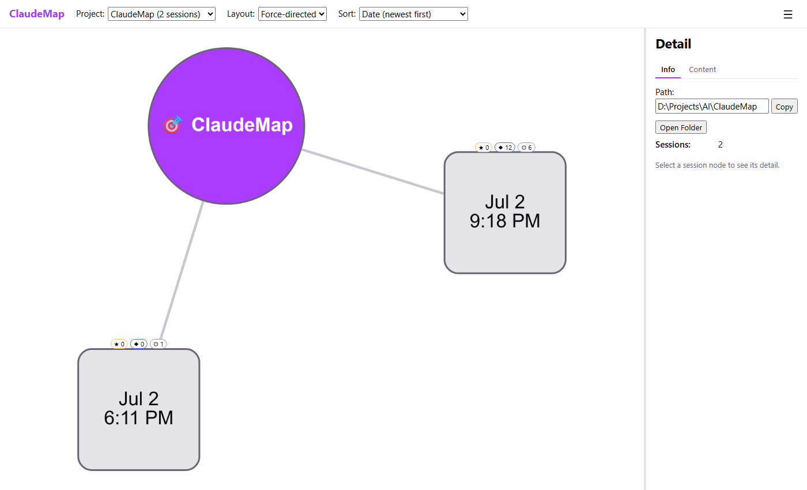
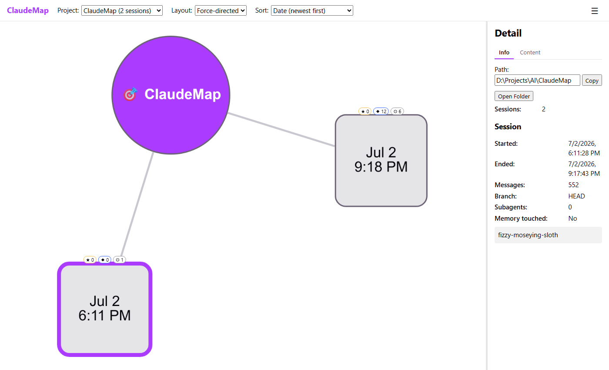
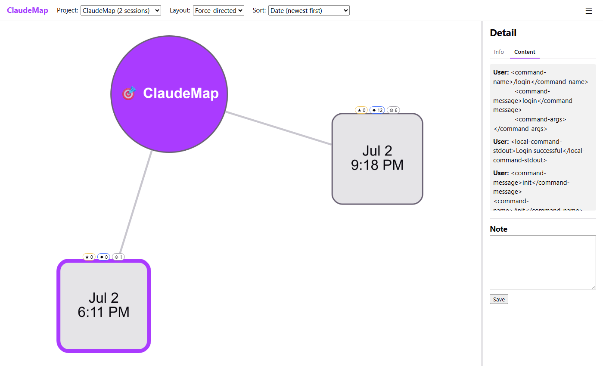
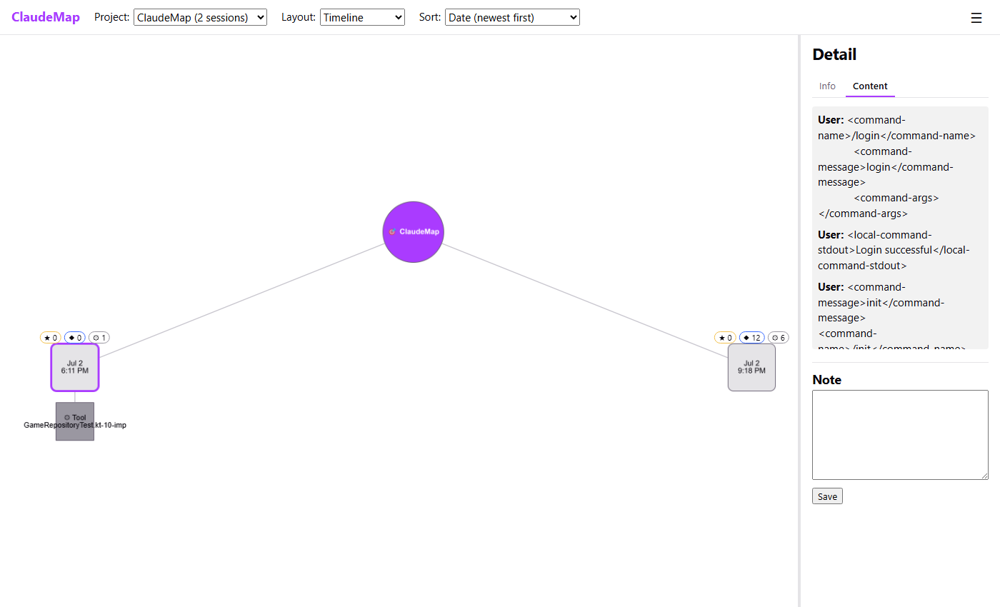

# Claude Session Explorer

A local tool that indexes your [Claude Code](https://claude.com/claude-code) session transcripts,
project memory files, and git activity, then renders them as a navigable graph — so you can find and
revisit valuable work across many long-running sessions instead of losing track of it.

Everything runs entirely on your own machine. No data leaves your computer.

## Screenshots

| Project graph | Session detail |
|---|---|
|  |  |

| Real session content | Timeline layout with drill-down |
|---|---|
|  |  |

## What it does

Claude Code sessions accumulate fast — dozens of chats per project, each with subagent runs, memory
writes, and decisions buried in the transcript. Claude Session Explorer scans your
`~/.claude/projects/` directory, parses every session's structure, and gives you a visual map:

- **Project → session graph** — pick a project, see every session as a node, positioned by a
  switchable layout (force-directed or hierarchical).
- **Session detail** — click a session to see when it happened, how many messages it had, its git
  branch, subagent count, and a content preview.
- **Custom scan roots** — point the tool at any folder containing Claude Code session data (e.g. an
  exported `.claude` directory from another machine), not just the default location.
- **Open in Explorer** — jump straight to a project's real folder on disk from the graph.
- **stick-it tagging** — a small slash command you install into any project so you can tag a moment
  in a live session as it happens; it shows up as a note the next time you visualize that project. See
  [`stick-it-skill/README.md`](stick-it-skill/README.md).

## Architecture

Two local services, no external dependencies:

| Component | Stack | Role |
|---|---|---|
| **Indexer** (`indexer/`) | Node.js · TypeScript · Express · better-sqlite3 | Parses session/memory files into a local SQLite index; serves a read-only HTTP API on `127.0.0.1:4317` |
| **Visualizer** (`visualizer/`) | TypeScript · React · Vite · Cytoscape.js | Browser app that renders the graph and consumes the Indexer's API |

The Indexer's database is a rebuildable cache — delete it any time and it re-parses from your session
files. User-added scan roots are stored separately so they survive a cache rebuild.

## Setup & Installation

### First Time Setup

From the repo root:

```bash
npm ci
npm run start
```

**What this does:**
- `npm ci` (clean install) — restores exact dependency versions for all packages (root + indexer + visualizer) using lock files
- `npm run start` — builds both services and launches them together in production mode

Open **http://localhost:5173** in your browser once both are up. The project picker populates from your real `~/.claude/projects/` directory.

### Transferring Between Systems (Restore After Download/Copy)

This project is designed to be fully portable. When you transfer it to a new system:

```bash
npm ci
```

That's it! The lock files (`package-lock.json`, `indexer/package-lock.json`, `visualizer/package-lock.json`) ensure exact version reproducibility across systems.

**Why portable:**
- `package-lock.json` files are committed to git — they lock all dependency versions
- `node_modules/` is in `.gitignore` — never transferred
- npm workspaces (`package.json` root config) — manages all three packages as one
- **Result:** Clone/copy the repo → run `npm ci` → instantly ready

### Choosing Your Installation Method

| Command | When to use | Speed |
|---------|-------------|-------|
| `npm ci` | Transfer to new system, CI/CD, reproducible builds | Fast (uses lock files) |
| `npm install` | First-time setup, updating dependencies | Slower (resolves versions) |

**Recommendation:** Always use `npm ci` for transfers and deployments; use `npm install` only when intentionally updating dependencies.

### CORS & Port Configuration

> The Indexer only accepts requests from `http://localhost:5173` / `http://127.0.0.1:5173` (CORS
> allowlist) — the root `start` script pins the Visualizer's preview server to port `5173` (Vite's
> own default preview port is `4173`) specifically so this works out of the box. If that port is
> already taken on your machine, free it first; changing the port would also require updating
> `ALLOWED_ORIGINS` in `indexer/src/config.ts`.

## Development

Prefer working on one service at a time with hot reload? Use two terminals:

```bash
# From repo root, install once
npm ci

# Terminal 1 — Indexer (backend API)
npm run dev -w indexer
# → http://127.0.0.1:4317
```

```bash
# Terminal 2 — Visualizer (frontend)
npm run dev -w visualizer
# → http://localhost:5173
```

### Testing & Building

Individual package commands (from the package directory or using `-w` flag from root):

```bash
# From root, run tests for a specific package:
npm test -w indexer              # vitest (Indexer unit tests)
npm run test:e2e -w indexer      # Playwright (Indexer integration)
npm run build -w indexer

npm test -w visualizer           # vitest (Visualizer unit tests)
npm run test:e2e -w visualizer   # Playwright (browser-level)
npm run build -w visualizer
```

Or work inside the package directory:

```bash
cd indexer
npm test            # vitest
npm run test:e2e    # Playwright
npm run build

cd visualizer
npm test            # vitest
npm run test:e2e    # Playwright
npm run build
```

## Status

Early-stage — the project/session navigator (graph, layout switching, session detail, custom scan
roots) is implemented and tested. Planned next: a chronological timeline layout, and drilling into a
session to see its subagent runs and memory activity as graph nodes.

## License

[MIT](LICENSE)
